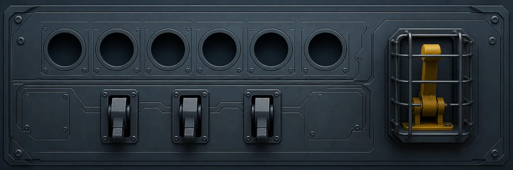
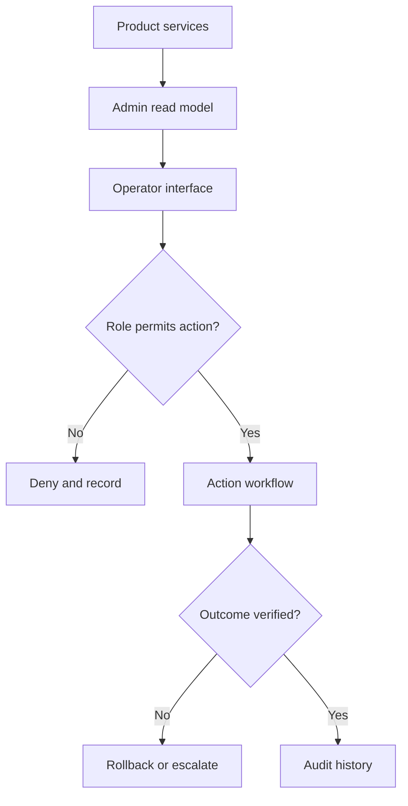

[← All systems](https://github.com/J0UH) · [Money and operations systems](https://github.com/J0UH/money-operations-systems)

  

# Operational control planes

The admin side of a product is where ambiguity becomes expensive. Operators need to see state, understand why it changed, take controlled action, and leave enough evidence for the next person.

## The engineering problem

These systems joined several generations of dashboards and services around changing products. The work included making state consistent, reducing hidden manual steps, and designing safer controls.

## Foundation and adaptation

Some dashboard generations began from licensed interface systems such as Metronic or from open-source admin templates; others were purpose-built applications and services. The work shown here covers the domain model, backend aggregation, role and action design, migration, and operating controls added around those foundations.

## What the system covers

- Administrative and support workflows
- Account, product, and transaction views
- Role-aware actions and approvals
- Backend aggregation and integration
- Audit history and operational reporting

## System shape

## Build notes

- Show operators the source and age of important state.
- Separate observation from action.
- Put confirmation and evidence around consequential controls.

Public overview only. Source code, customer data, credentials, and private operating details are not included.

## Talk through a similar problem

Working on something similar? [Tell me about it](mailto:ju@jomena.group?subject=Operational%20control%20planes).
