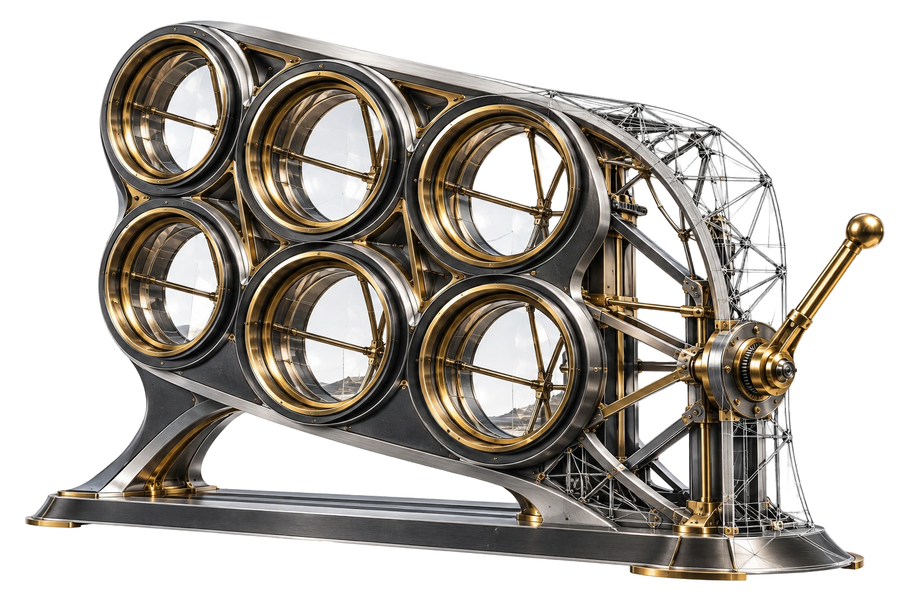
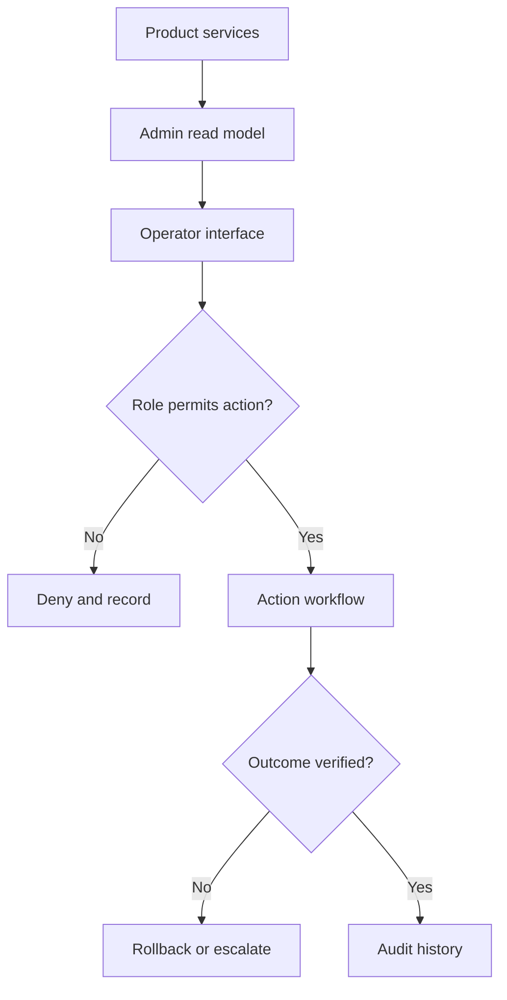

[← All work](https://github.com/J0UH) · [Money and operations systems](https://github.com/J0UH/money-operations-systems)

# Operational control planes

The administrator and support tools that make a complex product possible to operate.

An operator often arrives at the moment when the ordinary product flow no longer explains enough. An account has an unusual state, a transaction needs investigation, or an action needs review.

The dashboard and backend work focuses on giving that person a useful picture and a clear way to act. Some generations began from licensed or open-source interface foundations; others were purpose-built applications and services.

## Showing what the screen knows

A displayed value should have a source and a time boundary. When several services contribute to a view, the operator needs to understand whether they are seeing a current fact or a derived snapshot.

Observation and action also need distinct treatment. Looking at a transaction is different from changing it. Roles, approvals, and audit history belong around consequential controls.

The work covers domain modelling, aggregation, migrations, and the action model behind the interface. The aim is to reduce hidden manual steps while preserving the context the next operator will need.

## Built on

Some dashboard generations began from licensed interface systems such as Metronic or from open-source admin templates; others were purpose-built applications and services. The work shown here covers the domain model, backend aggregation, role and action design, migration, and operating controls added around those foundations.

## What the work covers

- Administrative and support workflows
- Account, product, and transaction views
- Role-aware actions and approvals
- Backend aggregation and integration
- Audit history and operational reporting

A closer look at the technical flow

## Related work

- [Money and operations systems](https://github.com/J0UH/money-operations-systems)
- [Regulated product portals](https://github.com/J0UH/regulated-product-portals)

Working on a similar problem? [Tell me what you are building](mailto:ju@jomena.group?subject=Operational%20control%20planes).

*This is a public account of the work. Source code and private operating details are not included in this repository.*
